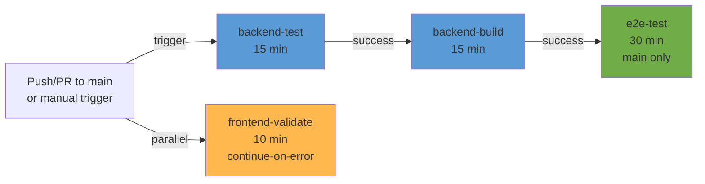

# GitHub Actions CI/CD Pipeline

MaKIT 프로젝트의 자동화된 CI/CD 파이프라인 문서입니다.

## 파이프라인 개요



## 작업 상세 설명

### 1. backend-test (의존성 없음, ~15분)
**언제 실행:** Push/PR, 모든 브랜치
- PostgreSQL 16 + pgvector 서비스 컨테이너 실행
- Maven 캐시 활용하여 빠른 실행
- `./mvnw clean test` 실행
- JaCoCo 커버리지 리포트 생성
- Codecov에 커버리지 업로드 (선택적, 실패해도 계속)
- 테스트 결과를 아티팩트로 저장

**환경 변수:**
- `SPRING_DATASOURCE_URL`: 테스트 DB PostgreSQL
- `AWS_*`: 테스트용 dummy 값

**산출물:**
- `backend/target/surefire-reports/` (JUnit 리포트)
- `backend/target/site/jacoco/` (JaCoCo 커버리지)

---

### 2. backend-build (backend-test에 의존, ~15분)
**언제 실행:** backend-test 성공 후
- `./mvnw clean package -DskipTests` 실행
- JAR 파일 생성 (e2e-test 및 향후 배포용)
- JAR을 아티팩트로 저장 (5일 보관)

**산출물:**
- `backend/target/makit.jar`

---

### 3. frontend-validate (의존성 없음, ~10분)
**언제 실행:** Push/PR, 모든 브랜치
**실패 옵션:** `continue-on-error: true` (경고만 표시, 파이프라인 계속)

- HTML 검증 (`npx html-validate`)
- CSS 검증 (`npx stylelint`)
- 두 검증 모두 선택적 (설치 실패 허용)

---

### 4. e2e-test (backend-build에 의존, ~30분)
**언제 실행:** 
- `push`로 main 브랜치에 푸시할 때
- 수동으로 workflow_dispatch 트리거할 때
- 개발 브랜치 PR은 skip (시간 절약)

**실행 순서:**
1. JAR 아티팩트 다운로드
2. PostgreSQL 16 서비스 시작
3. 백엔드 JAR 실행 + health check 대기
4. Playwright 브라우저 설치 (chromium/firefox/webkit)
5. `npx playwright test` 실행
6. HTML 리포트 + JUnit 결과 업로드

**환경 변수:**
- `MAKIT_BASE_URL=http://localhost:8080`
- `AWS_*`: 테스트용 dummy 값

**산출물:**
- `playwright-report/` (HTML 리포트)
- GitHub Actions 결과 페이지에 E2E 테스트 결과 표시

---

## 트리거 조건

```yaml
on:
  push:
    branches: [main, develop]    # main/develop에 푸시 시 전체 실행
  pull_request:
    branches: [main, develop]    # PR 생성/업데이트 시 backend-test, frontend-validate만
  workflow_dispatch:             # GitHub UI에서 수동 실행
```

**참고:**
- PR: backend-test + frontend-validate만 실행 (backend-build, e2e-test 스킵)
- main 푸시: 모든 작업 실행
- 수동 트리거: 모든 작업 실행

---

## 필수 환경 변수 및 시크릿

### 자동 설정 (하드코딩)
- 테스트 환경 PostgreSQL 자격증명 (임시)
- AWS 테스트용 dummy 키

### 선택적 시크릿 (GitHub Settings에서 설정)
```
CODECOV_TOKEN       # Codecov 업로드용 (생략 가능)
BEDROCK_API_KEY     # 프로덕션 E2E 테스트용 (현재 미사용)
```

---

## 로컬 개발에서 테스트 실행

### 백엔드 단위 테스트
```bash
cd backend
./mvnw clean test

# JaCoCo 리포트 생성
./mvnw jacoco:report
# 리포트 위치: backend/target/site/jacoco/index.html
```

### E2E 테스트 (로컬)
```bash
# 1. 백엔드 실행 (또는 docker-compose up)
cd backend && ./mvnw spring-boot:run

# 2. E2E 테스트 실행
npx playwright test

# 3. HTML 리포트 확인
npx playwright show-report
```

### Playwright 디버그 모드
```bash
PWDEBUG=1 npx playwright test
# 또는
npx playwright test --debug
```

---

## 문제 해결 (Troubleshooting)

### PostgreSQL extension 오류
**증상:** `ERROR: extension "pgvector" does not exist`

**해결:**
- CI에서는 `pgvector/pgvector:pg16` 이미지 사용 (자동 포함)
- 로컬에서 테스트 시: `CREATE EXTENSION IF NOT EXISTS pgvector;`

### Java 버전 불일치
**증상:** `javac: invalid target release: 21` (로컬)

**해결:**
```bash
# Java 21 설치 확인
java -version

# Maven wrapper로 실행 (권장)
./mvnw -v
```

### Playwright 브라우저 누락
**증상:** `Error: No browsers found`

**해결:**
```bash
npx playwright install --with-deps chromium
```

### 백엔드 시작 실패
**증상:** E2E 테스트가 Connection refused 에러

**해결:**
1. PostgreSQL 서비스 실행 확인: `curl -f http://localhost:5432/`
2. 백엔드 로그 확인: `docker logs <container-id>`
3. health check 대기 시간 증가 (기본 60초)

---

## 커버리지 목표

| 메트릭 | 목표 | 현재 상태 |
|-------|------|---------|
| Line Coverage | 70% | TBD |
| Branch Coverage | 60% | TBD |
| Complexity | < 10 | TBD |

**참고:** JaCoCo 리포트는 Codecov에 자동 업로드되므로 GitHub UI에서 Pull Request 코멘트로 확인 가능합니다.

---

## 성능 최적화

### 캐시 전략
- **Maven**: `~/.m2` 디렉토리 캐시 (2GB 제한)
- **Node.js**: npm cache 자동 (필요 시 `npm ci` 사용)
- **Playwright**: 브라우저는 매번 설치 (캐싱 미지원)

### 병렬 실행
- backend-test와 frontend-validate는 동시 실행
- backend-build는 backend-test 완료 후 실행
- e2e-test는 backend-build 완료 후 실행 (main만)

### Timeout 설정
| 작업 | Timeout |
|------|---------|
| backend-test | 15분 |
| backend-build | 15분 |
| frontend-validate | 10분 |
| e2e-test | 30분 |

---

## GitHub Actions 상태 확인

1. **리포지토리 → Actions 탭**에서 실행 내역 확인
2. **Pull Request**에서 "Checks" 섹션에서 상태 확인
3. **Badge 추가** (README.md):
   ```markdown
   
   ```

---

## 다음 단계

### 향후 개선 사항
- [ ] Snyk/OWASP 보안 검사 추가
- [ ] Gradle 마이그레이션 (현재 Maven)
- [ ] Docker 이미지 빌드 및 레지스트리 푸시
- [ ] 성능 벤치마크 (LCP/CLS/TTI 측정)
- [ ] 캐시 최적화 (특히 node_modules)

---

## 참고 자료

- [GitHub Actions 공식 문서](https://docs.github.com/en/actions)
- [Playwright CI 설정](https://playwright.dev/docs/ci)
- [Maven in CI/CD](https://maven.apache.org/guides/introduction/introduction-to-the-pom.html)
- [JaCoCo Maven Plugin](https://www.jacoco.org/jacoco/trunk/doc/maven.html)
- [Codecov Integration](https://about.codecov.io/language/java/)
