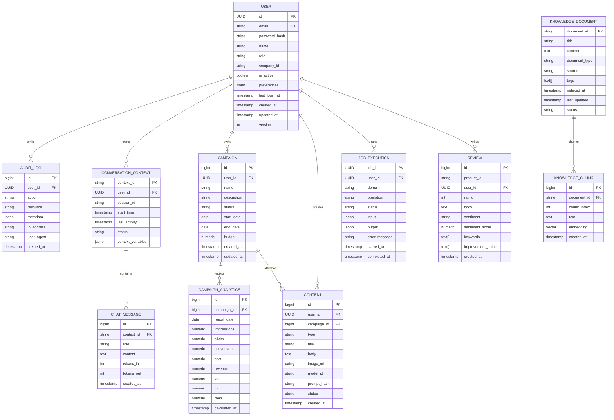

# MaKIT — Data Model (Phase 2)

**Author**: architect agent
**Date**: 2026-04-20
**Status**: Accepted (v1 baseline)
**Database**: PostgreSQL 15 + pgvector extension
**ORM**: Spring Data JPA (Hibernate 6)

---

## 1. ERD (Mermaid)



---

## 2. Entities — detail

### 2.1 `users`

| Column | Type | Constraint | Notes |
|---|---|---|---|
| id | UUID | PK, default `gen_random_uuid()` | — |
| email | VARCHAR(255) | UNIQUE, NOT NULL | lowercased on insert |
| password_hash | VARCHAR(100) | NOT NULL | BCrypt cost 12 |
| name | VARCHAR(80) | NOT NULL | — |
| role | VARCHAR(32) | NOT NULL, CHECK in (ADMIN, MARKETING_MANAGER, CONTENT_CREATOR, ANALYST, VIEWER) | — |
| company_id | VARCHAR(64) | NULL | tenant anchor |
| is_active | BOOLEAN | NOT NULL, DEFAULT TRUE | — |
| preferences | JSONB | NULL | UI prefs, rarely queried |
| last_login_at | TIMESTAMPTZ | NULL | audit |
| created_at | TIMESTAMPTZ | NOT NULL, DEFAULT now() | — |
| updated_at | TIMESTAMPTZ | NOT NULL, DEFAULT now() | — |
| version | INT | NOT NULL, DEFAULT 0 | `@Version` optimistic lock |

**Indexes**
- `UNIQUE(email)` — **WHERE** login lookup every request.
- `INDEX(company_id)` — **WHERE** tenant filter on list pages.

### 2.2 `audit_logs`

| Column | Type | Constraint | Notes |
|---|---|---|---|
| id | BIGSERIAL | PK | append-only |
| user_id | UUID | FK users.id, NULL | nullable for system events |
| action | VARCHAR(64) | NOT NULL | e.g. `LOGIN`, `GEN_CONTENT` |
| resource | VARCHAR(128) | NULL | e.g. `campaign:42` |
| metadata | JSONB | NULL | request/response summary |
| ip_address | INET | NULL | — |
| user_agent | VARCHAR(256) | NULL | — |
| created_at | TIMESTAMPTZ | NOT NULL, DEFAULT now() | — |

**Indexes**
- `INDEX(user_id, created_at DESC)` — **WHERE + ORDER BY** for per-user audit trail.
- `INDEX(created_at DESC)` — **ORDER BY** for admin global timeline.

### 2.3 `conversation_contexts`

| Column | Type | Constraint | Notes |
|---|---|---|---|
| context_id | VARCHAR(64) | PK | client-correlatable |
| user_id | UUID | FK users.id, NOT NULL | — |
| session_id | VARCHAR(64) | NOT NULL | browser session |
| start_time | TIMESTAMPTZ | NOT NULL, DEFAULT now() | — |
| last_activity | TIMESTAMPTZ | NOT NULL, DEFAULT now() | touched on every message |
| status | VARCHAR(16) | NOT NULL, CHECK in (ACTIVE, CLOSED, EXPIRED) | — |
| context_variables | JSONB | NULL | small bag (≤ 8KB) |

**Indexes**
- `INDEX(user_id, last_activity DESC)` — **WHERE + ORDER BY** for "my recent chats".
- `INDEX(status)` where `status='ACTIVE'` partial index — sweep of active sessions.

### 2.4 `chat_messages`

| Column | Type | Constraint | Notes |
|---|---|---|---|
| id | BIGSERIAL | PK | — |
| context_id | VARCHAR(64) | FK conversation_contexts, NOT NULL | — |
| role | VARCHAR(16) | NOT NULL, CHECK in (USER, ASSISTANT, SYSTEM) | — |
| content | TEXT | NOT NULL | — |
| tokens_in | INT | NULL | assistant rows only |
| tokens_out | INT | NULL | assistant rows only |
| created_at | TIMESTAMPTZ | NOT NULL, DEFAULT now() | — |

**Indexes**
- `INDEX(context_id, created_at ASC)` — **JOIN + ORDER BY** for conversation replay.

### 2.5 `knowledge_documents`

| Column | Type | Constraint | Notes |
|---|---|---|---|
| document_id | VARCHAR(64) | PK | caller-supplied or UUID |
| title | VARCHAR(256) | NOT NULL | — |
| content | TEXT | NOT NULL | original raw |
| document_type | VARCHAR(32) | NOT NULL | FAQ, POLICY, PRODUCT, etc. |
| source | VARCHAR(256) | NULL | URL or upload name |
| tags | TEXT[] | NULL | — |
| indexed_at | TIMESTAMPTZ | NULL | when chunks were embedded |
| last_updated | TIMESTAMPTZ | NOT NULL, DEFAULT now() | — |
| status | VARCHAR(16) | NOT NULL, CHECK in (DRAFT, INDEXED, STALE) | — |

**Indexes**
- `INDEX(document_type)` — **WHERE** filter on admin list.
- `GIN(tags)` — **WHERE** tag filter at retrieval time.

### 2.6 `knowledge_chunks` (pgvector)

| Column | Type | Constraint | Notes |
|---|---|---|---|
| id | BIGSERIAL | PK | — |
| document_id | VARCHAR(64) | FK knowledge_documents, NOT NULL, ON DELETE CASCADE | — |
| chunk_index | INT | NOT NULL | position |
| text | TEXT | NOT NULL | chunk text, ~500 tokens |
| embedding | VECTOR(1024) | NOT NULL | Titan Embed v2 |
| created_at | TIMESTAMPTZ | NOT NULL, DEFAULT now() | — |

**Indexes**
- `UNIQUE(document_id, chunk_index)` — idempotent re-indexing.
- `INDEX(document_id)` — **WHERE** cascade deletes and counts.
- `IVFFLAT(embedding vector_cosine_ops) WITH (lists=100)` — ANN search. Tune `lists` at ~sqrt(rows) after initial data load.

### 2.7 `campaigns`

| Column | Type | Constraint | Notes |
|---|---|---|---|
| id | BIGSERIAL | PK | — |
| user_id | UUID | FK users.id, NOT NULL | — |
| name | VARCHAR(128) | NOT NULL | — |
| description | TEXT | NULL | — |
| status | VARCHAR(16) | NOT NULL, CHECK in (DRAFT, ACTIVE, PAUSED, ENDED) | — |
| start_date | DATE | NULL | — |
| end_date | DATE | NULL | — |
| budget | NUMERIC(14,2) | NULL | — |
| created_at | TIMESTAMPTZ | NOT NULL, DEFAULT now() | — |
| updated_at | TIMESTAMPTZ | NOT NULL, DEFAULT now() | — |

**Indexes**
- `INDEX(user_id, status)` — **WHERE** "my active campaigns".
- `INDEX(status, end_date)` — **WHERE** cron expiry sweep.

### 2.8 `campaign_analytics`

| Column | Type | Constraint | Notes |
|---|---|---|---|
| id | BIGSERIAL | PK | — |
| campaign_id | BIGINT | FK campaigns.id, NOT NULL | — |
| report_date | DATE | NOT NULL | — |
| impressions | NUMERIC(14,2) | NOT NULL DEFAULT 0 | — |
| clicks | NUMERIC(14,2) | NOT NULL DEFAULT 0 | — |
| conversions | NUMERIC(14,2) | NOT NULL DEFAULT 0 | — |
| cost | NUMERIC(14,2) | NOT NULL DEFAULT 0 | — |
| revenue | NUMERIC(14,2) | NOT NULL DEFAULT 0 | — |
| ctr | NUMERIC(8,4) | NULL | pre-computed |
| cvr | NUMERIC(8,4) | NULL | pre-computed |
| roas | NUMERIC(10,4) | NULL | pre-computed |
| calculated_at | TIMESTAMPTZ | NOT NULL DEFAULT now() | — |

**Indexes**
- `UNIQUE(campaign_id, report_date)` — idempotent daily roll-up.
- `INDEX(report_date DESC)` — **ORDER BY** for time-range queries.

### 2.9 `contents`

| Column | Type | Constraint | Notes |
|---|---|---|---|
| id | BIGSERIAL | PK | — |
| user_id | UUID | FK users.id, NOT NULL | — |
| campaign_id | BIGINT | FK campaigns.id, NULL | optional attach |
| type | VARCHAR(32) | NOT NULL | INSTAGRAM_FEED, MODELSHOT, BLOG, etc. |
| title | VARCHAR(256) | NULL | — |
| body | TEXT | NULL | — |
| image_url | VARCHAR(512) | NULL | S3 key or presigned |
| model_id | VARCHAR(64) | NULL | Bedrock model used |
| prompt_hash | CHAR(64) | NULL | SHA-256, for cache keys |
| status | VARCHAR(16) | NOT NULL, CHECK in (DRAFT, PUBLISHED, ARCHIVED) | — |
| created_at | TIMESTAMPTZ | NOT NULL DEFAULT now() | — |

**Indexes**
- `INDEX(user_id, created_at DESC)` — **WHERE + ORDER BY** "my contents" list.
- `INDEX(campaign_id)` — **JOIN** from campaign detail page.
- `INDEX(prompt_hash)` — **WHERE** dedup cache lookup.

### 2.10 `job_executions`

| Column | Type | Constraint | Notes |
|---|---|---|---|
| job_id | UUID | PK | — |
| user_id | UUID | FK users.id, NOT NULL | — |
| domain | VARCHAR(16) | NOT NULL, CHECK in (data, marketing, commerce) | — |
| operation | VARCHAR(64) | NOT NULL | e.g. `modelshot.generate` |
| status | VARCHAR(16) | NOT NULL, CHECK in (PENDING, RUNNING, SUCCESS, FAILED) | — |
| input | JSONB | NOT NULL | request snapshot |
| output | JSONB | NULL | result |
| error_message | TEXT | NULL | populated when FAILED |
| started_at | TIMESTAMPTZ | NOT NULL DEFAULT now() | — |
| completed_at | TIMESTAMPTZ | NULL | set on terminal status |

**Indexes**
- `INDEX(user_id, started_at DESC)` — **WHERE + ORDER BY** "my jobs".
- `INDEX(status)` where `status IN ('PENDING','RUNNING')` partial — worker sweep.
- `INDEX(domain, operation)` — metrics roll-up.

### 2.11 `reviews`

| Column | Type | Constraint | Notes |
|---|---|---|---|
| id | BIGSERIAL | PK | — |
| product_id | VARCHAR(64) | NOT NULL | — |
| user_id | UUID | FK users.id, NULL | anonymous allowed |
| rating | SMALLINT | NOT NULL, CHECK BETWEEN 1 AND 5 | — |
| body | TEXT | NOT NULL | — |
| sentiment | VARCHAR(16) | NULL | populated by analysis |
| sentiment_score | NUMERIC(6,4) | NULL | — |
| keywords | TEXT[] | NULL | extracted themes |
| improvement_points | TEXT[] | NULL | LLM-derived |
| created_at | TIMESTAMPTZ | NOT NULL DEFAULT now() | — |

**Indexes**
- `INDEX(product_id, created_at DESC)` — **WHERE + ORDER BY** main aggregation query.
- `INDEX(sentiment)` — **WHERE** filter per sentiment.
- `GIN(keywords)` — theme filter.

---

## 3. JSONB vs normalized — decision notes

| Column | Choice | Rationale |
|---|---|---|
| `users.preferences` | JSONB | Rarely queried; shape evolves with UI. |
| `audit_logs.metadata` | JSONB | Write-heavy, read-rare; shape varies per action. |
| `conversation_contexts.context_variables` | JSONB | Small bag of session-scoped vars. |
| `job_executions.input/output` | JSONB | Heterogeneous per operation; retrieved only by jobId. |
| `knowledge_chunks.embedding` | `vector` (pgvector) | NOT JSONB — must be indexable for ANN. |
| `review.keywords`, `review.improvement_points` | `TEXT[]` | Array semantics, indexable with GIN, simpler than JSONB. |

Avoided JSONB for: campaign metrics (numeric aggregation needed), chat messages (role-based queries), anything requiring `ORDER BY` on values.

---

## 4. Flyway migration plan

Location: `backend/src/main/resources/db/migration/`.
Naming: `V{YYYYMMDDHHMM}__{snake_case}.sql` using 2026-04-20 as baseline.

| Version | File | Purpose |
|---|---|---|
| V202604201200 | `V202604201200__create_extensions.sql` | `CREATE EXTENSION IF NOT EXISTS "pgcrypto";` and `vector` |
| V202604201201 | `V202604201201__create_users.sql` | users + indexes |
| V202604201202 | `V202604201202__create_audit_logs.sql` | audit_logs |
| V202604201203 | `V202604201203__create_conversation.sql` | conversation_contexts + chat_messages |
| V202604201204 | `V202604201204__create_knowledge.sql` | knowledge_documents + knowledge_chunks + ivfflat index |
| V202604201205 | `V202604201205__create_campaigns.sql` | campaigns + campaign_analytics |
| V202604201206 | `V202604201206__create_contents.sql` | contents |
| V202604201207 | `V202604201207__create_jobs.sql` | job_executions |
| V202604201208 | `V202604201208__create_reviews.sql` | reviews |
| V202604201209 | `V202604201209__seed_demo_user.sql` | `marketer@example.com` / `password123` (BCrypt hash literal) for login demo |

Schemas: single `public` schema. `search_path=public`. No tenant-per-schema in v1.

---

## 5. Enums (Java side)

Backed by `VARCHAR` columns + `CHECK` constraints (not Postgres ENUM type — easier Flyway evolution).

```
UserRole         = ADMIN | MARKETING_MANAGER | CONTENT_CREATOR | ANALYST | VIEWER
ConversationStatus = ACTIVE | CLOSED | EXPIRED
MessageRole      = USER | ASSISTANT | SYSTEM
DocumentStatus   = DRAFT | INDEXED | STALE
CampaignStatus   = DRAFT | ACTIVE | PAUSED | ENDED
ContentStatus    = DRAFT | PUBLISHED | ARCHIVED
JobStatus        = PENDING | RUNNING | SUCCESS | FAILED
SentimentLabel   = POSITIVE | NEGATIVE | NEUTRAL | MIXED
```

Hibernate: `@Enumerated(EnumType.STRING)`.

---

## 6. Handoff notes

- **backend-engineer**: Entities live in their owning module package (e.g. `commerce.entity.Review`). Shared enums go into `common.enums`.
- **ai-engineer**: `KnowledgeChunk.embedding` uses Hibernate-ORM vector mapping via `com.pgvector:pgvector-hibernate` (already on classpath plan). Dimension locked at 1024 — matches Titan Embed v2.
- **devops-engineer**: RDS parameter group must set `shared_preload_libraries = 'vector'` or use the standard extension install step in V202604201200.
- Connection pool: HikariCP `maximumPoolSize=20`, `connectionTimeout=3s`, `statement_timeout=10s` applied via `spring.datasource.hikari.data-source-properties.options`.
