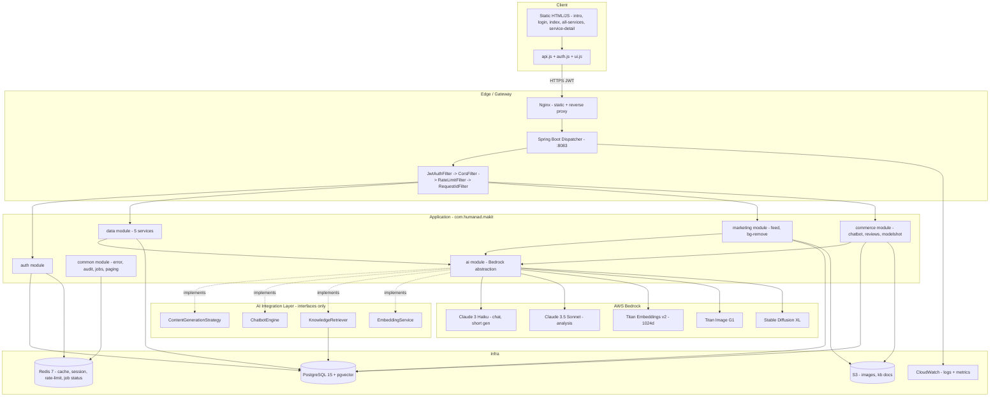

# MaKIT — System Design (Phase 2)

**Author**: architect agent
**Date**: 2026-04-20
**Status**: Accepted (v1 baseline)
**Scope**: AX Data Intelligence / AX Marketing Intelligence / AX Commerce Brain

This document extends the `설계 문서` / `Architecture` section of `README.md`. Where README is silent or generic, this file is authoritative.

---

## 1. High-Level Architecture



---

## 2. Module Boundaries

Base Java package: `com.humanad.makit`

| Module | Package | Responsibility | Depends on |
|---|---|---|---|
| `auth` | `com.humanad.makit.auth` | JWT issue/verify, login, register, user profile | `common` |
| `common` | `com.humanad.makit.common` | Error handling, `ApiErrorResponse`, audit log, paging DTO, async `JobExecution` registry, CORS/rate-limit filter | (none) |
| `data` | `com.humanad.makit.data` | NLP analyze, YouTube comments/influence/keyword-search, URL analyze | `common`, `ai` |
| `marketing` | `com.humanad.makit.marketing` | Instagram feed generation, background removal | `common`, `ai` |
| `commerce` | `com.humanad.makit.commerce` | RAG chatbot, review analysis, model-shot/image generation | `common`, `ai` |
| `ai` | `com.humanad.makit.ai` | `ContentGenerationStrategy`, `ChatbotEngine`, `KnowledgeRetriever`, `EmbeddingService` + Bedrock implementations | `common` |

**Hard rules**

1. `data`, `marketing`, `commerce` MUST NOT `import` each other. Cross-domain orchestration happens only through a saga/facade in `common` if ever needed.
2. `ai` exposes only the four interfaces listed below. Controllers and services never call the AWS SDK directly.
3. Entities live in the module that owns them. Shared value objects (e.g. `ApiErrorResponse`, `PageResponse`) live in `common`.
4. Controllers return `ResponseEntity<ApiResponse<T>>` or `ResponseEntity<PageResponse<T>>`. No raw entity leakage.

---

## 3. AI Integration Layer — Interfaces (signatures only)

The ai-engineer agent implements these. Backend agents program against these. Four interfaces, ~20 methods total.

```java
package com.humanad.makit.ai;

// ---- 1) Generic generation (text + image) --------------------------
public interface ContentGenerationStrategy {
    CompletableFuture<GeneratedContent> generateText(TextGenerationRequest req);
    CompletableFuture<GeneratedImage>   generateImage(ImageGenerationRequest req);
    CompletableFuture<GeneratedImage>   editImage(ImageEditRequest req);   // bg-remove, model-shot
    boolean supports(ContentType type);
    ModelInfo getActiveModel(ContentType type);                            // id + provider
}

// ---- 2) Chatbot streaming + sync -----------------------------------
public interface ChatbotEngine {
    ChatResponse chat(ChatRequest req, ConversationContext ctx);
    Flux<ChatStreamChunk> chatStream(ChatRequest req, ConversationContext ctx); // SSE backing
    ConversationContext openContext(UUID userId, String sessionId);
    void closeContext(String contextId);
}

// ---- 3) RAG retrieval ----------------------------------------------
public interface KnowledgeRetriever {
    List<RetrievedChunk> retrieve(String query, RetrievalOptions opts);    // topK, threshold, filters
    void indexDocument(KnowledgeDocumentRef ref, String rawText, Map<String,String> meta);
    void deleteDocument(String documentId);
    void reindexAll();                                                     // admin
}

// ---- 4) Embeddings (shared primitive) ------------------------------
public interface EmbeddingService {
    float[] embed(String text);                                            // 1024-dim
    List<float[]> embedBatch(List<String> texts);
    int dimension();
    String modelId();
}
```

All requests carry a `requestId` (UUID) propagated into MDC and returned in the response.

---

## 4. Non-Functional Targets

| Concern | Target | Mechanism |
|---|---|---|
| Latency — text AI call | p50 < 4s, p95 < 15s | Claude Haiku default; Sonnet only on explicit `quality=HIGH` |
| Latency — image AI call | p95 < 45s | 202 Accepted + async `/jobs/{jobId}` polling |
| Latency — non-AI endpoints | p95 < 300ms | Cached where safe (Redis TTL 60s) |
| Throughput | 50 RPS sustained | Virtual threads (`spring.threads.virtual.enabled=true`), HikariCP max 20 |
| Availability | 99.5% app (v1) | ECS Fargate 2 tasks behind ALB |
| Error budget | < 1% 5xx over 30d window | CloudWatch alarm on `http.server.requests{status=5xx}` |

**Timeouts**
- HTTP read timeout (client): 60s
- Bedrock invocation timeout: 30s for text, 90s for image
- Database statement timeout: 10s (set via `statement_timeout`)

**Concurrency**
- Use Java 21 virtual threads for Bedrock calls (IO-bound). Each controller method runs on a virtual thread.
- DB access remains on platform threads via HikariCP to avoid pinning.

---

## 5. Security Architecture

### 5.1 JWT flow (v1, self-issued)

```
Client -> POST /api/auth/login {email,password}
Backend: BCrypt verify -> issue access JWT (15m) + refresh JWT (7d, rotated, stored in Redis by jti)
Client stores access in memory/localStorage; refresh in httpOnly cookie (when FE wired up, v1.1)
Client -> Authorization: Bearer <access>  for all /api/** except /api/auth/login, /api/auth/register, /actuator/**
JwtAuthFilter -> validates signature (HS256 v1; RS256 migration path in ADR-002) + exp + issuer
Refresh: POST /api/auth/refresh {refreshToken} -> Redis lookup by jti, rotate
Logout: POST /api/auth/logout -> Redis add jti to blacklist until exp
```

Claims: `sub` (userId UUID), `email`, `role`, `companyId`, `iat`, `exp`, `jti`.

### 5.2 CORS

- Allowed origins (env-driven): `http://localhost:8080`, `http://localhost:5173`, `https://makit.example.com`
- Allowed methods: GET, POST, PUT, PATCH, DELETE, OPTIONS
- Allowed headers: Authorization, Content-Type, X-Request-Id
- `allowCredentials: true`
- Preflight cache 3600s

### 5.3 Rate limiting

- Bucket4j with Redis backend.
- Default: 60 req/min per user (JWT `sub`), 30 req/min per IP for anonymous.
- AI-heavy endpoints (all `/api/commerce/modelshot/**`, `/api/marketing/feed/generate`): 10 req/min per user.
- `429` with `Retry-After` header.

### 5.4 Secrets

- `JWT_SECRET`, `AWS_ACCESS_KEY_ID`, `AWS_SECRET_ACCESS_KEY`, `DB_PASSWORD`, `REDIS_PASSWORD` from env.
- In ECS, pulled from AWS Secrets Manager, injected as env via task definition.
- Never logged. `logging.level.com.humanad.makit.ai=INFO` does not include request bodies.

---

## 6. Observability

### 6.1 Structured logging

JSON logs via Logback `LogstashEncoder`. Fields:

```
timestamp, level, logger, thread, traceId, requestId, userId, domain, operation, durationMs, message, stackTrace
```

`requestId` set by `RequestIdFilter` from `X-Request-Id` header or generated as UUIDv4. Echoed in response header.

### 6.2 Metrics (Micrometer -> CloudWatch)

| Metric | Tags | Purpose |
|---|---|---|
| `http.server.requests` | uri, method, status | RED metrics |
| `makit.ai.invocation.duration` | model, operation, outcome | AI latency SLO |
| `makit.ai.invocation.tokens` | model, direction(in/out) | Cost tracking |
| `makit.job.status` | domain, operation, status | Async job throughput |
| `makit.rag.retrieval.hits` | topKHit, threshold | RAG quality |
| `makit.auth.login` | outcome(success/fail) | Security signal |
| `hikaricp.connections.active` | pool | DB saturation |

### 6.3 Health

- `/actuator/health` — liveness (always 200 if process up)
- `/actuator/health/readiness` — DB + Redis reachable + Bedrock warmup ok
- `/actuator/info` — git commit, build time, version

---

## 7. Scalability

### 7.1 Virtual threads for AI

Spring Boot 3.2 `spring.threads.virtual.enabled=true`. Bedrock SDK calls are blocking IO; virtual threads let us fan out without a dedicated executor. No synchronized blocks around network IO in our code.

### 7.2 Async job pattern (for image gen, batch analysis)

```
Client POST /api/commerce/modelshot/generate
Server: validate -> persist JobExecution(status=PENDING) -> enqueue (in-process @Async with virtual thread)
        -> return 202 { jobId, statusUrl }
Worker: JobExecution -> RUNNING -> call AI -> persist result -> SUCCESS
Client GET /api/commerce/jobs/{jobId} -> current status + result when SUCCESS
```

For v1 the queue is in-process (bounded `ArrayBlockingQueue`, fail-fast on overflow). v2 swaps to SQS without contract change — `JobExecution` row is the source of truth either way.

### 7.3 Chatbot streaming

SSE (`text/event-stream`) via Spring WebFlux `Flux<ServerSentEvent>` on a single endpoint `/api/commerce/chatbot/stream`. The non-streaming `/message` endpoint wraps the same `ChatbotEngine.chat` call for clients that cannot consume SSE.

### 7.4 Caching

- Redis keys:
  - `cache:nlp:{hash(text)}` TTL 600s — identical text requests
  - `cache:url:{hash(url)}` TTL 1800s — URL analyze
  - `session:{userId}:{sessionId}` TTL 1800s — active chat context handle
  - `jwt:blacklist:{jti}` TTL = remaining exp
  - `ratelimit:{subject}` — Bucket4j state
- `@Cacheable` used only for deterministic, idempotent reads.

---

## 8. Deployment topology (handoff to devops-engineer)

- Single Spring Boot jar -> Docker image -> pushed to ECR -> ECS Fargate service.
- Port: **8083** (aligns with frontend hardcoded `localhost:8083` — see R3 in orchestrator plan; frontend base URL becomes env-driven in Phase 3 via `api.js`).
- PostgreSQL 15 via RDS (v1 can run in docker-compose for dev).
- Redis 7 via ElastiCache (dev: docker-compose).
- S3 bucket `makit-assets-{env}` with presigned PUT URLs for uploads.

---

## 9. What is deliberately out of scope for v1

- AWS Cognito (see ADR-002)
- Multi-region
- Real-time analytics pipeline (Kinesis/Firehose) — CampaignAnalytics is batch written
- GraphQL — REST only
- SEO/퍼포먼스 분석 detailed modules — placeholder endpoints only if needed
