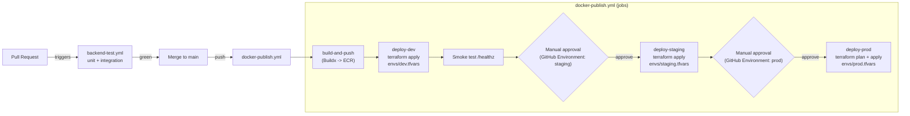

# MaKIT — CI/CD Flow

**Author**: devops-engineer
**Date**: 2026-04-20

## Pipeline overview



## Triggers

| Event                | Workflow              | Action                                            |
|----------------------|-----------------------|---------------------------------------------------|
| PR opened / updated  | `backend-test.yml`    | Run unit + integration tests (JUnit, Testcontainers) |
| Push to `main`       | `docker-publish.yml`  | Build images, tag with `${{ github.sha }}` and `latest`, push to ECR |
| After build-and-push | `deploy-dev` job      | `terraform apply` with new image tag               |
| After dev smoke OK   | `deploy-staging`      | Requires approval via GitHub Environment `staging` |
| After staging deploy | `deploy-prod`         | Requires approval via GitHub Environment `prod`    |
| Manual dispatch      | `workflow_dispatch`   | Re-run pipeline on demand                          |

## GitHub Environments (configure once per repo)

Create three Environments under **Settings → Environments**:

| Env       | Required reviewers | Secrets                                      |
|-----------|--------------------|----------------------------------------------|
| `dev`     | none               | inherit repo-level secrets                   |
| `staging` | 1 reviewer         | inherit                                      |
| `prod`    | 2 reviewers        | inherit; optional env-specific AWS_ROLE_ARN  |

Repository-level secrets required:

- `AWS_ROLE_ARN` — ARN of the `makit-github-oidc-role` IAM role
- `ECR_REGISTRY` — `<ACCOUNT_ID>.dkr.ecr.ap-northeast-2.amazonaws.com`
- `TF_STATE_BUCKET` — `makit-tfstate-<ACCOUNT_ID>`
- `TF_STATE_LOCK_TABLE` — `makit-tfstate-lock`

## OIDC trust

The GitHub OIDC role trusts the repository's `main` branch only:

```
token.actions.githubusercontent.com:sub == repo:<ORG>/<REPO>:ref:refs/heads/main
```

This means:
- Branch builds cannot assume the role → cannot push to ECR or deploy.
- Only merged `main` commits reach deployment steps.

## Image tagging strategy

Each build tags three references:

| Tag            | Purpose                                   |
|----------------|-------------------------------------------|
| `${git_sha}`   | Immutable — used by Terraform apply       |
| `latest`       | Convenience only — never referenced by tasks in prod |

Task definitions in ECS always use the specific SHA (via Terraform var),
never `latest` in prod. This gives every deploy a unique, rollbackable
task definition revision.

## Rollback

Two rollback modes:

1. **Fast** (image only): re-run the workflow with a previous good `github.sha`
   via `workflow_dispatch`, or manually set `backend_image_tag`/`frontend_image_tag`
   in tfvars and run `terraform apply`.
2. **Full infra**: revert the Terraform change in git, then `terraform apply`
   on the affected env.

## Protecting prod

- Branch protection: `main` requires PR + passing `backend-test`
- Prod environment: requires manual approval; optionally restrict to CODEOWNERS
- Terraform prod uses **plan file** (`prod.plan`) and applies the exact plan —
  no drift between plan review and apply
