# Feature Dependency Graph

## Overview

MaKIT 플랫폼은 21개의 상호 연결된 기능으로 구성되어 있으며, 다음과 같이 계층화되어 있습니다:

- **Platform Layer (11개)**: 인증, 감사, 알림, 대시보드, PWA, i18n 등의 기초 시설
- **AX Data Intelligence (5개)**: NLP 분석, URL 분석, YouTube 댓글/영향력/키워드 검색
- **AX Marketing Intelligence (3개)**: 피드 생성, 배경 제거, 모델컷 생성
- **AX Commerce Brain (2개)**: AI 챗봇, 리뷰 분석

**핵심 특징**:
- `auth` (인증)와 `audit` (감사)가 가장 많은 기능에 의존됨 (Foundation)
- `marketing-hub`는 4개 내부 기능 의존 (최상위 소비자)
- 모든 기능이 DAG 구조 (순환 의존 없음)
- AWS Bedrock 통합이 대부분의 AI 기능에 필수

## Mermaid Diagram

```mermaid
graph TD
    subgraph "Platform Foundation"
        AUDIT["감사 로그"]
        AUTH["인증 & 관리"]
        DASH["대시보드"]
        AI["AI 인사이트"]
    end
    
    subgraph "Platform Services"
        NOTIF["알림 시스템"]
        PUSH["푸시 알림"]
        PWA["PWA"]
        I18N["다국어 지원"]
        ADMIN["관리자 대시보드"]
        JOBS["작업 관리"]
    end
    
    subgraph "AX Data Intelligence"
        NLP["NLP 자연어 분석"]
        URL["URL 분석"]
        YTC["유튜브 댓글"]
        YTI["유튜브 영향력"]
        YTK["유튜브 키워드"]
    end
    
    subgraph "AX Marketing Intelligence"
        FEED["피드 생성"]
        REMBG["배경 제거"]
        MODEL["모델컷 생성"]
    end
    
    subgraph "AX Commerce Brain"
        CHAT["챗봇"]
        REVIEW["리뷰 분석"]
    end
    
    subgraph "Integrated Hub"
        HUB["마케팅 허브"]
    end
    
    AUTH --> DASH
    AUDIT --> DASH
    AUDIT --> AI
    
    AUTH --> ADMIN
    AUDIT --> ADMIN
    
    AUTH --> NOTIF
    AUDIT --> NOTIF
    NOTIF --> HUB
    
    AUTH --> PUSH
    AUDIT --> PUSH
    
    AUTH --> PWA
    AUDIT --> PWA
    
    AUTH --> I18N
    AUDIT --> I18N
    
    AUTH --> JOBS
    AUDIT --> JOBS
    
    AUTH --> NLP
    AUDIT --> NLP
    
    AUTH --> URL
    AUDIT --> URL
    
    AUTH --> YTC
    AUDIT --> YTC
    JOBS --> YTC
    
    AUTH --> YTI
    AUDIT --> YTI
    
    AUTH --> YTK
    AUDIT --> YTK
    
    AUTH --> FEED
    AUDIT --> FEED
    
    AUTH --> REMBG
    AUDIT --> REMBG
    
    AUTH --> MODEL
    AUDIT --> MODEL
    
    AUTH --> CHAT
    AUDIT --> CHAT
    
    AUTH --> REVIEW
    AUDIT --> REVIEW
    
    AUTH --> HUB
    AUDIT --> HUB
    AI --> HUB
    NOTIF --> HUB
    
    classDef platform fill:#dce1f9,stroke:#334bfa,stroke-width:2px,color:#000
    classDef axdata fill:#d7efdc,stroke:#0f7134,stroke-width:2px,color:#000
    classDef axmkt fill:#fef3c7,stroke:#92400e,stroke-width:2px,color:#000
    classDef axcom fill:#fee2e2,stroke:#991b1b,stroke-width:2px,color:#000
    classDef hub fill:#e8d5f2,stroke:#7c3aed,stroke-width:2px,color:#000
    
    class AUDIT,AUTH,DASH,AI,NOTIF,PUSH,PWA,I18N,ADMIN,JOBS platform
    class NLP,URL,YTC,YTI,YTK axdata
    class FEED,REMBG,MODEL axmkt
    class CHAT,REVIEW axcom
    class HUB hub
```



## SVG Dependency Graph


## 분석 (Analysis)

### 계층 구조 (Layered Architecture)

#### Foundation Layer (0단계)
- **audit**: 가장 기본적인 기능, 20개 기능에 의존됨 (최고 진입점)
  - 모든 사용자 행동을 추적하는 감사 로그
  - 규제 준수, 보안 감사에 필수

#### Infrastructure Layer (1단계)
- **auth**: 사용자 인증 (JWT + RefreshToken + RateLimit)
  - 17개 기능에 의존됨 (audit 다음으로 높음)
  - 모든 보안 경계의 첫 번째 방어선
  - 데모 사용자 시딩, 비밀번호 관리 포함
  
- **dashboard**: 사용자 통계 및 활동 추적
  - auth에 의존하며, auth가 의존
  - 사용자별 활동 집계 및 인사이트 제공
  
- **ai**: Bedrock Claude 기반 인사이트 생성
  - audit에 의존
  - marketing-hub가 주요 소비자

#### Platform Services Layer (2단계)
- **notifications** (2개 이상 의존): WebSocket + 데이터베이스 기반 실시간 알림
  - marketing-hub의 주요 의존성
  - 사용자가 중요한 이벤트를 즉시 인지
  
- **push-notifications**: Web Push API (VAPID)
  - OS 레벨 푸시 알림
  - 독립 기능 (notifications과 별도)
  
- **pwa**: Progressive Web App (Service Worker)
  - 모바일 설치, 오프라인 지원
  - 모든 클라이언트 기능의 기초
  
- **i18n**: 다국어 지원 (한국어/영어/일본어)
  - 모든 페이지에서 동적 번역
  - 글로벌 시장 진출 준비
  
- **admin-dashboard**: 관리자 역할 기반 대시보드
  - 플랫폼 통계, 사용자 관리
  - ROLE_ADMIN으로 접근 제어
  
- **jobs**: 비동기 작업 관리
  - youtube-comments가 유일한 소비자 (비동기 처리)

#### Product Layer (3단계)

**AX Data Intelligence** (5개):
- **nlp-analyze**: 자연어 감정/의도 분석 (Bedrock Claude)
- **url-analyze**: 웹페이지 SEO/키워드/구조 평가
- **youtube-comments**: 유튜브 댓글 수집 및 클러스터링
  - jobs 의존 (장시간 실행 작업)
- **youtube-influence**: YouTube 채널 영향력 지표 (구독자, 조회수, 참여율)
- **youtube-keyword-search**: YouTube 키워드 트렌드 및 경쟁도 분석

→ 모두 `auth` + `audit`에 의존

**AX Marketing Intelligence** (3개):
- **feed-generate**: 소셜 미디어 피드 콘텐츠 자동 생성
- **remove-bg**: 이미지 배경 제거 (투명 PNG)
- **modelshot**: 상품 설명 → AI 생성 모델 이미지

→ 모두 `auth` + `audit` + `aws-bedrock` 의존

**AX Commerce Brain** (2개):
- **chatbot**: RAG 기반 고객 상담 챗봇 (실시간 스트리밍)
- **review-analysis**: 상품 리뷰 감정 분석 및 개선사항 도출

→ 모두 `auth` + `audit` + `aws-bedrock` 의존

#### Composite/Aggregation Layer (4단계)
- **marketing-hub**: 4개 의존 (최고 소비자)
  - `auth`, `audit` (기반)
  - `ai` (주간 인사이트)
  - `notifications` (실시간 알림)
  - 캠페인 CRUD, 콘텐츠 라이브러리, 일정, 성과 분석 통합
  - 마케터의 "single pane of glass"

### Dependency Heatmap (의존도 분석)

| Feature | In-Degree | Out-Degree | Role |
|---------|-----------|------------|------|
| **audit** | 0 | 20 | Foundation (모든 기능이 의존) |
| **auth** | 1 | 17 | Critical infrastructure |
| **notifications** | 2 | 1 | Service (marketing-hub만 의존) |
| **ai** | 1 | 1 | Service (marketing-hub만 의존) |
| 기타 platform (6) | 2 | 0 | Base infrastructure |
| 기타 product (10) | 2 | 0 | Leaf services (독립적) |

### 순환 의존 검사 (Cycle Detection)

**결론: DAG (Directed Acyclic Graph) ✅**

- 모든 기능이 단방향 의존성만 가짐
- 순환 의존 없음 → 빌드 순서, 배포 순서 명확
- 점진적 통합 가능

**추천 배포 순서**:
1. audit (foundation)
2. auth, dashboard, ai, jobs (platform base)
3. notifications, push-notifications, pwa, i18n, admin-dashboard (platform services)
4. nlp-analyze, url-analyze, youtube-* (ax-data)
5. feed-generate, remove-bg, modelshot (ax-marketing)
6. chatbot, review-analysis (ax-commerce)
7. marketing-hub (composite)

### 결합도 분석 (Coupling Analysis)

**High Coupling Features**:
- `audit`: 매우 높은 진입점 밀도 (20개)
  - 장점: 중앙 집중식 감시
  - 위험: audit 성능 저하 → 모든 기능 영향
  
- `auth`: 높은 진입점 (17개)
  - 장점: 강력한 보안 경계
  - 위험: 인증 장애 → 플랫폼 마비

**Low Coupling Features**:
- Product layer (10개): 모두 `auth` + `audit`만 의존
  - 장점: 신규 기능 추가 시 기존 기능 영향 없음
  - 장점: 병렬 개발 가능

**Isolation**:
- No isolated features
- All connected to foundation (audit/auth)

### 확장성 고찰 (Scalability Insights)

**병렬 개발 가능 영역**:
- All product features (10) can be developed independently
- Each AX service depends only on (auth, audit)
- No inter-service dependencies in product layer

**향후 기능 추가 전략**:
1. New AI feature? → 기존 pattern (auth + audit + bedrock)
2. New platform service? → (auth + audit) 의존만 권장
3. New composite hub? → (auth + audit + existing services) 통합

### 외부 의존성 분석 (External Dependencies)

**Critical External**:
- `postgresql` (모든 기능 의존) → DB 장애 = 플랫폼 마비
- `aws-bedrock` (대부분의 AI 기능 의존) → 비용, 지연 시간 주의

**Optional External**:
- `redis` (marketing-hub만) → 성능 최적화
- `chart.js` (marketing-hub만) → 시각화
- Spring ecosystem (`spring-security`, `io.jsonwebtoken`) → auth에 국한

## 의존성 정리 (Dependency Summary)

### 기능별 의존성 목록

```
## Platform Layer (11)
- audit: [] → used by 20 (foundation)
- auth: [audit, dashboard] → used by 17
- dashboard: [audit] → used by 1 (auth)
- ai: [audit] → used by 1 (marketing-hub)
- notifications: [auth, audit] → used by 1 (marketing-hub)
- push-notifications: [auth, audit] → used by 0
- pwa: [auth, audit] → used by 0
- i18n: [auth, audit] → used by 0
- admin-dashboard: [auth, audit] → used by 0
- jobs: [auth, audit] → used by 1 (youtube-comments)
- marketing-hub: [auth, audit, ai, notifications] → used by 0 (hub)

## AX Data Intelligence (5)
- nlp-analyze: [auth, audit] → used by 0
- url-analyze: [auth, audit] → used by 0
- youtube-comments: [auth, audit, jobs] → used by 0
- youtube-influence: [auth, audit] → used by 0
- youtube-keyword-search: [auth, audit] → used by 0

## AX Marketing Intelligence (3)
- feed-generate: [auth, audit] → used by 0
- remove-bg: [auth, audit] → used by 0
- modelshot: [auth, audit] → used by 0

## AX Commerce Brain (2)
- chatbot: [auth, audit] → used by 0
- review-analysis: [auth, audit] → used by 0
```


